# InfernalSynth

InfernalSynth is a free, open-source, semi-modular software synthesizer and audio effect plugin.\
It is currently available as a VST3 plugin only, and ships as different binaries for instrument mode and effect mode.\
In instrument mode, InfernalSynth is a polyphonic synthesizer where the combined output of all voices is routed through a global effect bank.\
In effect mode, the voice generators are not used, and instead an external audio source is routed through the same global effect bank.\
\
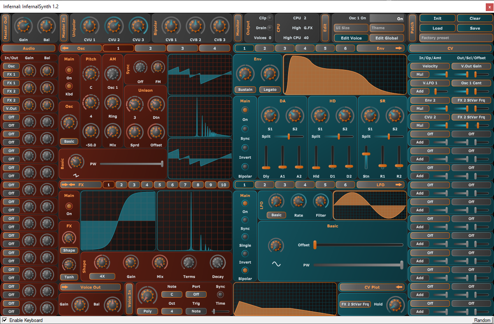

## Versioned builds

InfernalSynth ships as different binaries for Generic and Versioned releases. All Generic builds have the same
VST3 plugin ID. Versioned builds all have different VST3 plugin ID's (so they are essentially different plugins
from the host's point of view).

- Use the Generic build if you want to be able to load old projects using a new plugin version, get bugfixes automatically, and don't mind breaking changes.
- Use the Versioned build (preferred) if you want stuff to just keep working and be shielded from breaking changes. Newer versions of the plugin can work side-by-side with older versions.

## Theming

Due to VST3's bundle format, InfernalSynth can easily be themed if you're comfortable editing json files.\
See /Contents/Resources/Themes/(theme name)/themefile.json. It contains a root section definining all colors \
on a global level, an audio section containing overrides for the oscillator, fx and audio matrix, and a cv \
section containing overrides for the lfo, envelope and cv matrix. The background images live in the same folder, \
they can be swapped for anything else as long as the other image has the same dimensions.

## Architecture

InfernalSynth is conceptually split up into 5 parts:

- Output: monitors CPU usage, clipping and voice count.
- Global CV: LFO's, CV matrix, and CV plot section displaying stacked CV modulation.
- Global audio: effects, audio matrix, and Master section with common synth-wide controls.
- Per-voice CV: envelopes, LFO's, CV matrix, and CV plot section displaying stacked CV modulation.
- Per-voice audio: oscillators, effects, audio matrix, and Voice section with common per-voice controls.

The maximum voice count is limited to 32. If this number is exceeded, the oldest voice (the one that started
earliest among all active voices) is recycled to make room for the new incoming voice.

## Routing overview

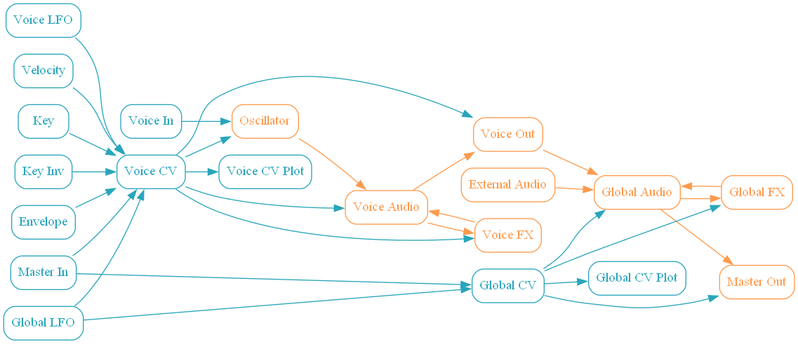

## Automation and modulation

Nearly all parameters in InfernalSynth can be automated. On top of that, a sizeable amount
of parameters can also be modulated. Modulation always takes place *on top of* automation.

- If it can be modulated, it can also be automated.
- If it can be modulated, both modulation *and* automation are sample-accurate.
- If it can't be modulated, automation is either applied per-voice or per-block (for global parameters).
- If it's discrete-valued (i.e. on/off, bar tempo, dropdowns, integer-valued knobs) it can NOT be modulated.
- If it's continuous-valued (i.e. dB, Hz, %), and not a CV parameter (like LFO rate) or a time parameter (like delay time) it can be modulated.
- Oscillator PM is the odd-one out, this is a hidden parameter and can only be used as a modulation target, but it can't be automated.

## Aliasing

In general, rapid modulation WILL introduce aliasing.\
Especially oscillator FM and PM, and rapid filter modulation WILL cause aliasing artifacts.\
InfernalSynth does NOT contain any global measures (like oversampling) to counteract such artifacts.\
However, individual components are either bandlimited or have options to reduce aliasing:

- Envelopes
    - Not bandlimited at all.
    - Use the slope parameters to smooth out rough edges as needed.
- Effects
    - Filter, Delay and Reverb do not introduce new harmonics.
    - Waveshaper has an oversampling parameter to cut down aliasing to an acceptible level.
- Oscillators
    - DSF is bandlimited by definition.
    - Mix is a sum of bandlimited basic oscillators, see below.
    - Noise is NOT bandlimited, use filters to get an acceptible audio signal.
    - Karplus-Strong has non-bandlimited transients, then quickly decays to sine.
    - Basic
        - Sine is bandlimited by definition.
        - Triangle is sort-of bandlimited using PolyBLAMP.
        - Saw and pulse are sort-of bandlimited using PolyBLEP.
- LFO's
    - Basic Sine is bandlimited by definition.
    - Other basic forms are NOT bandlimited at all.
    - Custom and Random forms are NOT bandlimited at all.
    - Use the filter control to smooth out rough edges as needed.
    - Use the Custom form slope parameters to smooth out rough edges as needed.
    
## Context menu options

Context menu opens by right-click on a module (osc, lfo, env, etc) header. \
Through the context menu you can reset module values to default, or copy/swap between modules of the same type.

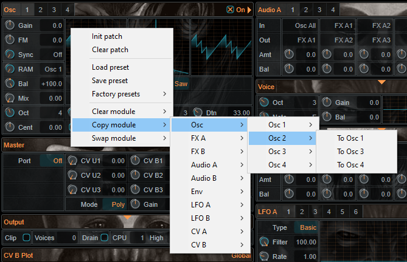

## Oscillator section

Per-voice oscillator with classic, noise, DSF, Karplus-Strong and mixed-classic generator types, phase, frequency, ring and amplitude modulation, hard sync and unison support.

- Type: generator type, see below.
- PM (hidden, modulation target only): phase modulation.
- FM: generic frequency modulation target, works nice in combination with hard sync.
- Sync: hard sync source. Either Off, or has to be less than than the current oscillator, otherwise has no effect.\
Please note that hard sync is per-unison-voice, so the source has to have at least as many voices as the target.
- Graphs
    - Audio Left, Right
    - Frequency spectrum
- Unison
    - Uni: voice count.
    - Detune: detune amount.
    - Spread: stereo spread amount.
    - Offset: phase start offset for phase-based generators (basic, dsf, and mix).
- Pitch control
    - Note, Octave, Cent: oscillator base pitch.
    - Kbd: keyboard tracking, react to incoming notes (on) or keep constant pitch (off).
- Ring and Amplitude modulation
    - Mix: fades between unmodulated and modulated signal.
    - Ring: down is amplitude modulation, up is ring modulation. Fades in between.
    - Source: modulation source. Has to be less than or equal to the current oscillator, otherwise has no effect.
- Generators
    - Basic: Classic waveform generator
        - Sine/saw/triangle/pulse generator.
        - PW: pulse width for pulse generator.
    - Mix: Combination of Basic generators
        - PW: pulse width for basic pulse generator.
        - Saw, Sine, Pulse, Tri: basic generator amount.
    - K+S: Karplus-Strong generator
        - Filter: filters the initial excitation.
        - Feedback: use to shorten low-frequency notes.
        - Stretch: use to lengthen high-frequency notes.
    - Noise: Noise generator
        - Seed: random seed.
        - X/Y: down goes towards static, up goes towards white noise.
        - Color: controls frequency spectrum, down goes towards flat spectrum, up goes towards white noise.
    - DSF: Create complex waveforms by layering sines, without actually generating each sine individually.
        - Dist: frequency distance, expressed as times the base frequency.
        - Parts: maximum number of partials. Internally, always limited to the Nyquist frequency.
        - Decay: falloff of harmonics. Increase/decrease to affect relative amplitude of subsequent partials.

## Effect section

Both per-voice and global effect modules, containing a comb filter, state-variable filter,
and multiple waveshapers (both voice and global), and a feedback delay, multi-tap delay and reverb mode (global only).

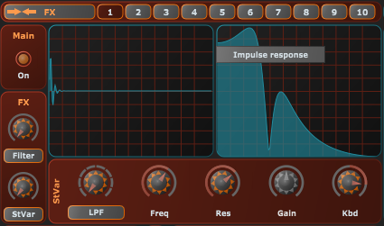

- Type: effect type
- Reverb
    - Graphs: Audio Left, Right
    - Size: room size.
    - Sprd: stereo spread.
    - Damp: damping factor.
    - Mix: crossfades between dry/wet.
    - APF: allpass filter feedback amount.
- Shaper
    - Graphs
        - Shaper response to ramp in time domain.
        - Frequency spectrum of shaper response to sine wave.
    - Shape: shaper algorithm, hard clip, tanh, fold, sine, chebyshev1 (single term) or chebyshev2 (stacked terms).
    - Over: oversampling factor.
    - Terms: order for chebyshev shapers.
    - Mix: crossfade between original and shaped waveform.
    - Gain: input gain. Turn up to increase the effect of the shaper.
    - Decay: amplitude falloff of consecutive terms for stacked chebyshev mode.
- Delay
    - Graphs: Audio Left, Right.
    - Amt: decay amount.
    - Sprd: stereo-spread amount.
    - Mix: crossfades between dry/wet.
    - Delay: delay mode, feedback or multi-tap.
    - Hold: time before the delay line kicks in.
    - Sync: specify delay time absolute (seconds) or relative to BPM (bars).
    - Feedback delay
        - L/R: left/right delay time/tempo.
    - Multi-tap delay:
        - Taps: tap count.
        - Time/tempo: per-tap delay time.
- Filter
    - Filter: filter mode, comb or state variable.
    - Graphs
        - Impulse response
        - Frequency response
    - Comb filter
        - Gain-: feed-back amount.
        - Dly-: feed-back delay time.
        - Gain+: feed-forward amount.
        - Dly+: feed-forward delay time.
    - State variable filter
        - Freq: cutof-off / center frequency.
        - Res: resonance. Increase for a steeper response. High values will produce self-oscillation.
        - Flt: filter mode. Regular low/high/band pass, bandstop, allpass, equalizer and shelving filters.
        - Gain: gain amount for shelving filters (LSH, HSH, BLL). Defines attenuation at center frequency.
        - Kbd: keyboard tracking amount. When non-zero, alters the filter frequency based on the voice midi note (or last midi note for global) relative to C4.

## Audio matrix

Both per-voice and global audio routing modules.
Voice matrix routes oscillators to effects, effects to other effects, and voice mixdown to the Voice output section.
Global matrix routes external audio input (in effect mode) or Voice output section (in instrument mode) to effects, effects to other effects, and mixdown to the Master section.
An audio source may be assigned to multiple targets or vice-versa, but note that effects can only be routed to higher-numbered effects
(e.g. FX 2 to FX 3, but not FX 2 to FX 1), otherwise the input will be silence.

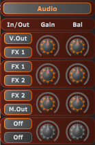

- In: audio signal input
- Out: audio signal output
- Amt: input signal amplitude
- Bal: input signal stereo balancing

## Voice output section

Controls per-voice gain and balance. Please note: envelope 1 (Amp Env) is hard-wired to voice gain.

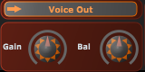

- Gain: amplitude of single voice output.
- Bal: stereo balancing of single voice output.

## Voice input section

Provides pitch translators affecting all oscillators, portamento settings and poly/monophonic mode selection.

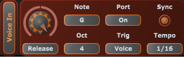

- Oct, Note: oscillator pitch offset relative to C4.
- Mode: select polyphonic/monophonic mode.
    - Poly: regular polyphonic mode.
    - Mono: true monophonic mode (voice count will never exceed 1).
    - Release: notes play in a single voice untill an explicit note-off is received. \
    Then, a new monophonic section is started, while the release section of the previous one continues, so voice count may exceed 1.
- Portamento
    - Time/tempo: glide time.
    - Sync: specify glide duration absolute (seconds) or relative to BPM (bars).
    - Port: portamento mode.
        - Off: no portamento.
        - On: glides one semitone in the specified time, so glide time is variable and glide pitch is constant.
        - Auto: glides pitch difference between old and new note in the specified time, so glide time is constant and glide pitch is variable.
    - Trig: portamento trigger.
        - Note: always trigger portamento on a new note.
        - Voice: trigger portamento on a new note, except for the first note in a new monophonic section. Useful in combination with release portamento mode.

## Master output section

Controls global gain and balance.

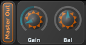

- Gain: amplitude of master mixdown.
- Bal: stereo balancing of master mixdown.

## Master input section

Contains a couple of freely-assignable CV sources. These CV sources don't do
anything by themselves, but may be routed to multiple CV targets, thereby providing a single automation target.
For example, route CVU 1 to both voice gain and FX 1 state variable frequency, and control both at the same
time, using a single parameter, from the host.

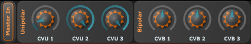

- CVB: bipolar virtual CV param level.
- CVU: unipolar virtual CV param level.

## Envelope section

Per-voice DAHDSR envelope generator with retrigger and multitrigger options, optional sustain, 
bipolar and inverted modes, and 2 stages with customizable slope and split level for each of attack, decay, and release sections.
Please note: if release length is zero, envelope sustains at it's final pre-release level.

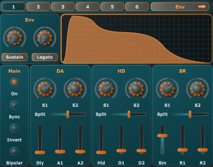

- Graphs: Envelope.
- Type
    - Sustain: regular sustain mode, holds at sustain level untill note off.
    - Follow: exactly follows the envelope, completely ignoring note-off (so, does NOT hold at sustain).
    - Release: follows the envelope, but enters release section as soon as note off is encountered (so, does NOT hold at sustain).
- Mode: only pertains to non-polyphonic voice modes, i.e., only take effect within a monophonic section.
    - Legato: envelope is not retriggered untill the next monophonic voice section.
    - Retrig: envelope is reset to zero and starts over at Attack when a new note is received.
    - Multi: envelope is reset to current level and starts over at Attack when a new note is received.
- Bipolar: switch unipolar/bipolar mode.
- Invert: vertically invert the envelope.
- Delay: delay time before the attack section.
- Split: split level between A1/A2, D1/D2, and R1/R2.
- Hold: hold time at full-scale after the attack section.
- Sync: section lengths are specified absolute (seconds) or relative to BPM (bars).
- A1/D1/R1: duration of the first part of the attack, decay and release sections.
- A2/D2/R2: duration of the second part of the attack, decay and release sections.
- Slope1/2: slope of the first/second part of the attack, decay and release sections.
- Sustain: sustain at this level after the decay section, and before the release section, untill a note-off event is received.

## LFO section

Both per-voice and global LFO modules with classic, random and custom generator types,
bipolar and inverted modes, one-shot option and smoothing filter.

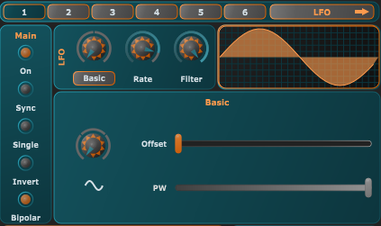

- Graphs: LFO.
- Rate/tempo: LFO frequency.
- Type: generator type, see below.
- Bipolar: switch unipolar/bipolar mode.
- Invert: vertically invert the waveform.
- Filter: simple lowpass filter used to smooth LFO output.
- Sync: LFO frequency/period is specified absolute (Hz) or relative to BPM (bars).
- Single: toggle single-cycle/one-shot mode (LFO ends after one cycle). Not really useful for global LFO's.
- Generators
    - Basic: Classic waveform generator.
        - Sine/saw/triangle/pulse generator.
        - PW: pulse width for pulse generator.
    - Free: custom generator with 8 sections and customizable slopes.
        - Each section duration is relative to the total waveform length.
        - A1, A2, Slope: control the first and second upward sections.
        - D1, D2, Slope: control the first and second downward sections.
        - Delay: delay time before first attack section and after first decay section.
        - Hold: hold time after the first attack section and after second decay section.
    - Random: random generator.
        - Will fold-back if above 1 or below 0.
        - Type: random type.
            - Slope: picks a new level at each step and gradually moves to that value.
            - Level: picks a new level at each step and immediately jumps to that value.
            - Both: picks a new level at each step, immediately jumps to that value, then gradually moves to the next level.
        - Steps: step/section count within a single cycle.
        - SeedY: controls the level at the beginning of a new step.
        - Amt: controls next step level relative to current step level.
        - RandX: allows control of the horizontal seed. If disabled, each section has equal length.
        - SeedX: a single cycle always has step count equal to the steps parameter, but if RandX is enabled, relative section length may be varied using this parameter.

## CV section

Both per-voice and global CV matrices.
Per-voice CV can use any modulation source (Velocity/Key/Voice LFO/Global LFO/Envelope/Master CV).
Global CV can only use global modulation sources (Global LFO/Master CV).
A CV source may be assigned to multiple targets or vice-versa.
When multiple sources are assigned to a single target, modulation is stacked.
In this case the order of assignment matters, for example, envelope1->target1 followed by lfo1->target1
is different from lfo1->target1 followed by envelope1->target1.
See the CV plot section to view exactly how stacked modulation plays out.\
\
For per-voice CV, midi in is available as a modulation source ("keyboard tracking anything").
This allows to use the incoming midi note relative to C4, scaled and offset by configurable parameters,
to be assigned to any modulation output.\
\
Also for per-voice CV, global modulation sources can be used in "Hold" mode.
In this case, the modulation signal is fixed to it's current value at the start
of the voice. This is useful for example in combination with a global random-type
LFO, to have each new voice receive a single new random value at voice start
(say, assigned to filter frequency), then keep at that same filter frequency
for the lifetime of the voice.

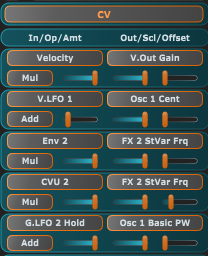

- In: CV input signal.
- Out: CV signal target parameter.
- Op: modulation operation.
- Amount: how much of the (adjusted) CV signal to apply to the target parameter.
- Offset, Scale: adjust the base and range of the incoming signal. For example with offset = 0.4, scale = 0.5, the adjusted signal will be between offset = 0.4 and (1 - offset) * scale = 0.7.
   
For Key/Key Inv sources, Offset and Scale scale "out" rather than "in". For all other CV sources, these parameters are used to narrow
the effect of modulation. For Key/Key Inv sources, they are used to widen the effect of modulation, for example to have full range (0%-100%)
between C3 and C5, rather than C0 and C9.

## CV plot section

Both per-voice (CV A) and global (CV B) CV visualizers.
Select a target parameter to view the combined (stacked) modulation signal that's routed to that parameter.

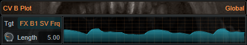

- Tgt: target parameter.
- Length (global):  plot length in seconds.
- Key (voice): key-down time, affects the sustain section of the envelope generators.

## Output section

Monitor section just to get an idea of what the plugin is doing.

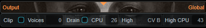

- Voices: active voice count. InfernalSynth is internally limited to 32 voices.
- Drain: indicates whether maximum voice count is exceeded and voices are being recycled.
- Clip: indicates whether the audio output exceeds [-1, +1]. Output is NOT actually clipped, since that is the task of the host.
- High, High CPU: indicate which module is currently using the most CPU relative to total usage.
For example, "FX B", "80%" indicates that 80% of total processing time was spent in the global fx modules.
- CPU: absolute total CPU usage measured as the percentage of time the plugin needs to render a single audio buffer relative to the buffer size.
For example, with 5 millisecond buffers, 20% CPU indicates that the plugin rendered the last buffer in 1 millisecond.