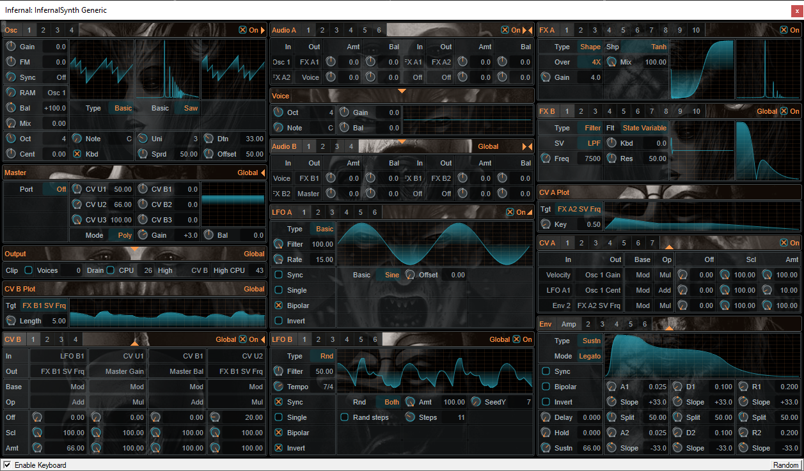

# About
InfernalSynth is a semi-modular software synthesizer and effect plugin.\
For system requirements, download and installation, see the [project website](https://sjoerdvankreel.github.io/infernal-synth).\
\

# Legal

VST is a trademark of Steinberg Media Technologies GmbH, 
registered in Europe and other countries.
 

# Dependencies
- Laurent de Soras' HIIR library: [http://ldesoras.free.fr/](http://ldesoras.free.fr/).
- Steinberg VST3 SDK: [https://github.com/steinbergmedia/vst3sdk](https://github.com/steinbergmedia/vst3sdk).

# Credits
- Artwork by DanteCyberman: [Seven deadly sins](https://www.deviantart.com/dantecyberman/art/Seven-deadly-sins-442680725).
- Contains a slightly adapted implementation of [Jezar's Freeverb](https://github.com/sinshu/freeverb).
- Contains a slightly adapted implementation of the [Karplus-Strong algorithm](https://blog.demofox.org/2016/06/16/synthesizing-a-pluked-string-sound-with-the-karplus-strong-algorithm).
- Contains a verbatim implementation of [Andrew Simper's state variable filter equations](https://cytomic.com/files/dsp/SvfLinearTrapOptimised2.pdf).
- Contains a verbatim implementation of [Moorer's DSF algorithm as described by Burkhard Reike](https://www.verklagekasper.de/synths/dsfsynthesis/dsfsynthesis.html).

Furthermore parts of InfernalSynth are implemented based on various resources found mostly on
[KVR Audio](https://www.kvraudio.com), [DSP Stackexchange](https://dsp.stackexchange.com),
[Music DSP](https://www.musicdsp.org) and [DSP Related](https://www.dsprelated.com).
Look for // http:// or // https:// in the source code for sources relevant to a specific feature.

# How to build
- Clone infernal synth into /path/to/infernal
- Download HIIR (see CMakeLists for version): [http://ldesoras.free.fr/prod.html](http://ldesoras.free.fr/prod.html) and copy to /path/to/hiir
- On windows (be sure to use a shell that knows msbuild, such as visual studio developer command prompt): cd /path/to/infernal/scripts && build_win32.bat /path/to/hiir
- On Linux (experimental, only Ubuntu 22 tested, known bugs): cd /path/to/infernal/scripts && ./build_linux.sh /path/to/hiir. See https://steinbergmedia.github.io/vst3_doc/vstgui/html/page_setup.html for dependencies.
- The build scripts will clone the vst3 sdk, set some submodules to infernal-specific forks/branches, run cmake & make/msbuild for both the vst sdk and infernal itself.
- If all goes well, final output is produced in /path/to/infernal/dist.
